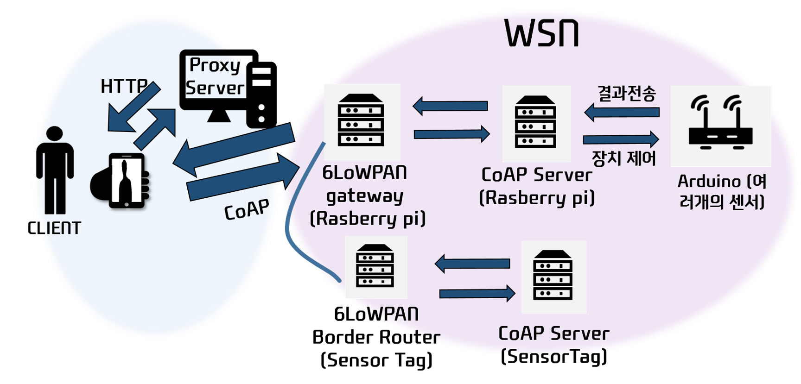
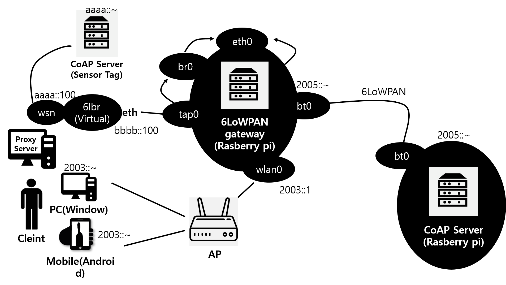
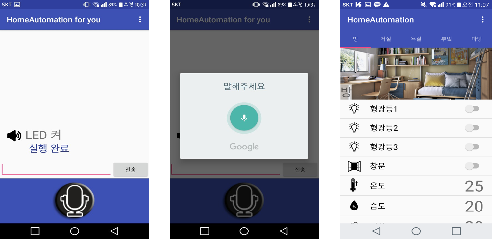
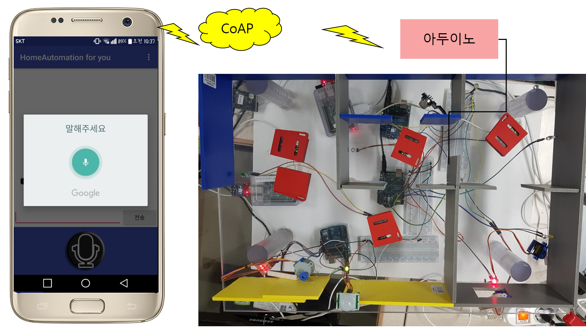

CoAP-6LoWPAN-Based-Homenetwork-System
===
### Date: 2017-01~ 2017년 종합설계 프로젝트
-------------

## Subtrees
- `ServerCoapRd` for `RD 서버`
- `ServerCoapBroker` for `XBee 브로커 서버`
- `ServerCoapProxy` for `프록시 서버`
- `ServerCoapNode` for `센서 노드 - 웹 Coap 서버`
- `ClientCoapAndroid` for `안드로이드 클라이언트`
-------------

## 개요
To create a communication environment based on the Internet of things, sensor devices that require low power communication must be connected to the Internet, and 6 Lo WPAN is emerging as a powerful tool for this.

## 6LoWAPN
A protocol that enables connection to IP networks using WPAN technology instead of WLAN technology. Used in ultra-small, low-power-power, low-quality devices.

## CoAP
A protocol for constrained networks.
Message size small and load free (light).
Simple construction.
Support for IPv6 and IPv4.
Compatible with HTTP (interchangeable).

-------------

### 시스템 수행 시나리오

### 시스템 구성도

### CoAP/6LoWPAN 통신 어플리케이션

### 데모 

